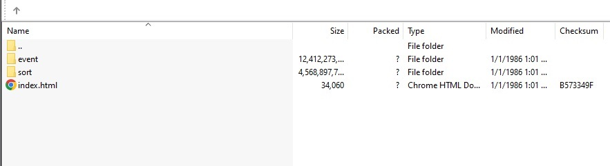
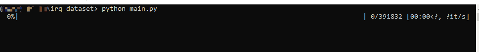
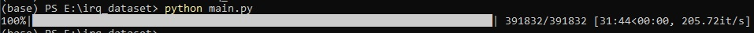
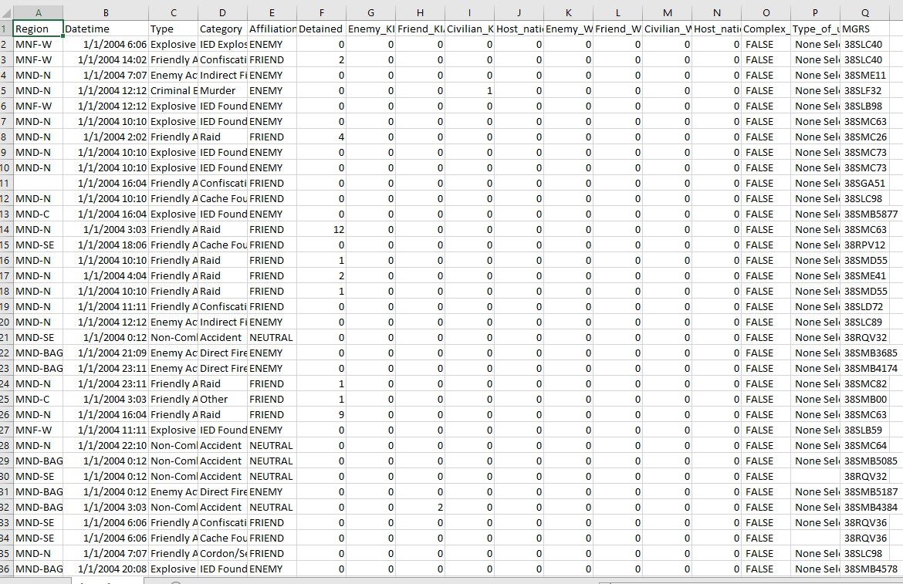

# Wikileak's Iraq War Logs Dataset


Multiprocessing script to parse all 391.832 [Wikileaks Iraq War Logs SIGACT html files](https://www.wikileaks.org/War-Diary-Iraq-War-Logs.html)
to create a dataset with the tabular information of every SIGACT.

## Folder structure
```bash
\IRQ_DATASET
│   functions.py
│   main.py
│   MIT-LICENSE.txt
│   README.md
│   requirements.txt
│   __init__.py
├───irq
    ├───event
        ├───2004
        ├───2005
        ├───2006
        ├───2007
        ├───2008
        ├───2009
├───img
```

## Usage

Download the Iraq War Logs from [Wikileaks torrents](https://file.wikileaks.org/torrent/) and extract the event folder
inside \irq_dataset\irq.



```bash
git clone https://github.com/chiflmas/iraq_dataset.git
python main.py
```





It creates a .csv file with 391.832 rows.



## License

[MIT](https://choosealicense.com/licenses/mit/)
